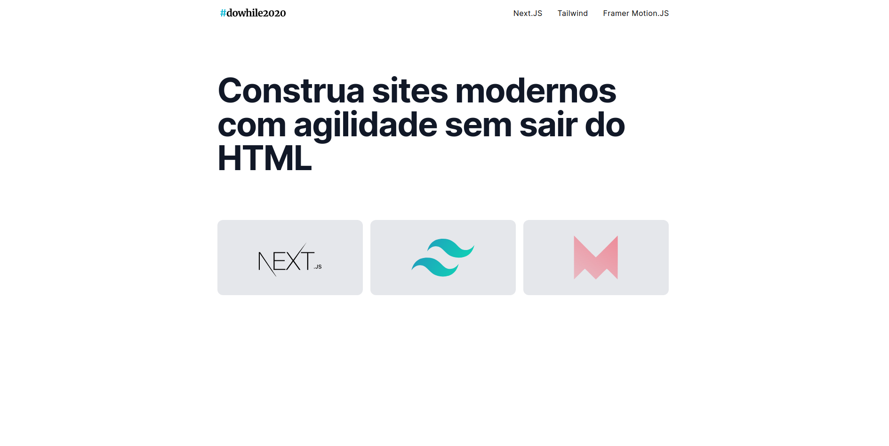

# Workshop - Next.js & TailwindCSS & Framer Motion

We'll build a lightweight, animated & responsive small website.

<h1 align="center">
  <br /> <br />
    
</h1>


# `Indice`

<a href="#Next">1. Next</a> <br />
<a href="#Tecnologias-utilizadas">2. Tecnologias utilizadas</a> <br />
<a href="#Como-baixar-o-projeto">3. Como baixar o projeto</a>

## Next

Criando interfaces modernas mantendo a produtividade. Com uma incrível experiência de desenvolvimento, construiremos interfaces completas com TailwindCSS, criaremos páginas animadas com **Next.js e Framer Motion**. Abordando **responsividade (Mobile First)** e transições entre as rotas da aplicação!


## Tecnologias utilizadas

O projeto foi desenvolvido utilizando as seguintes tecnologias:

- React
- Next.js
- TypeScript
- framer-motion
- TailwindCSS
---

## Como baixar o projeto
```bash

  # Clonar o repositório
  $ git clone https://github.com/DevTeles/next-tailwind-framermotion.git

  # Entrar no diretório
  $ cd next-tailwind-framermotion

  # Instalar as dependências
  $ yarn ou npm install

  # Iniciar o projeto
  $ yarn dev ou npm run dev
```

<br /><br />
Desenvolvido por **Rafael Teles Vital**
